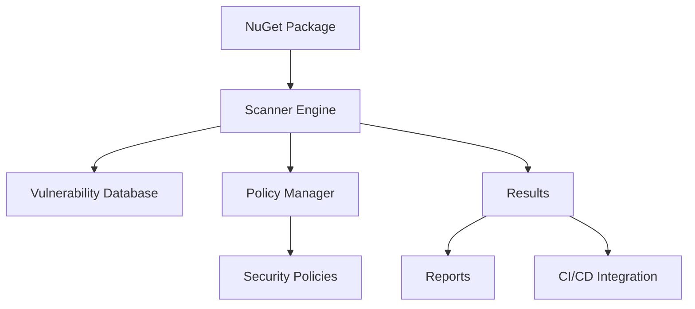

# NuGuard Architecture

## Overview

NuGuard is a security-focused package management solution for .NET applications. It provides vulnerability scanning, dependency analysis, and security policy enforcement for NuGet packages.

## Core Components

### 1. Scanner Engine
- Performs security analysis of NuGet packages
- Checks for known vulnerabilities using multiple data sources
- Validates package signatures and integrity

### 2. Policy Manager
- Enforces security policies
- Manages allow/deny lists
- Handles policy configuration and validation

### 3. Integration Layer
- CLI interface for direct usage
- MSBuild integration
- CI/CD pipeline plugins

## Data Flow

## Security Features

1. **Package Validation**
   - Signature verification
   - Hash validation
   - Source authentication

2. **Vulnerability Scanning**
   - Known CVE checking
   - Dependency graph analysis
   - License compliance

3. **Policy Enforcement**
   - Package source restrictions
   - Version pinning
   - Dependency constraints

## Integration Points

- MSBuild tasks for Visual Studio integration
- Command-line interface for manual operations
- REST API for third-party integrations
- CI/CD pipeline plugins (GitHub Actions, Azure DevOps, etc.)

## Configuration Management

Security policies and scanner configurations are managed through:
- JSON configuration files
- Environment variables
- Command-line arguments

## Extensibility

The system is designed to be extensible through:
- Custom policy providers
- Plugin architecture for new security checks
- Custom vulnerability data sources
